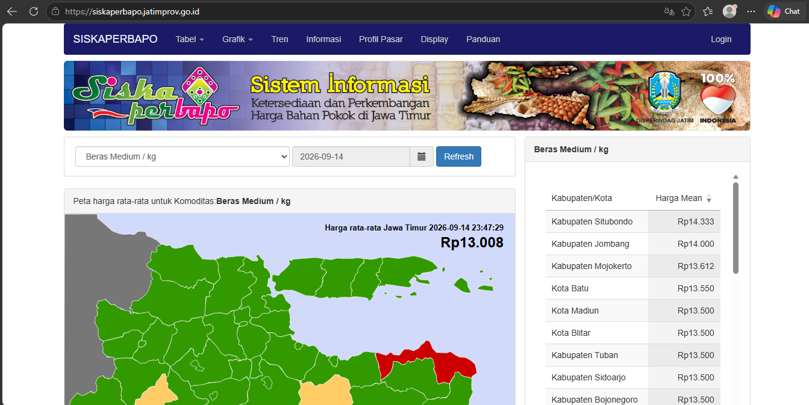
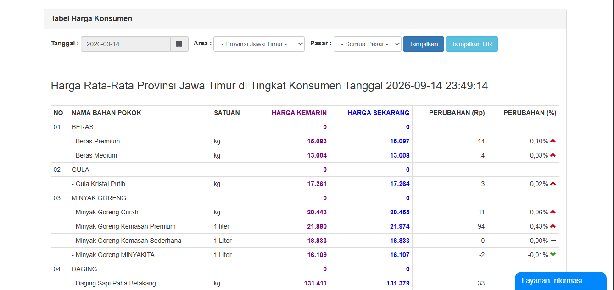
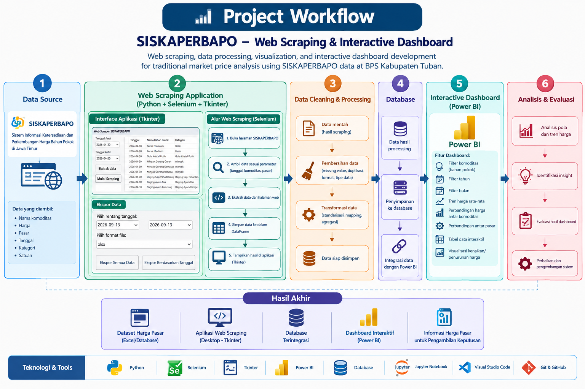
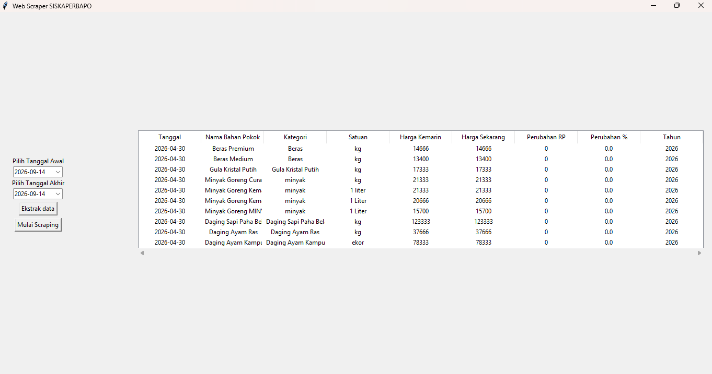
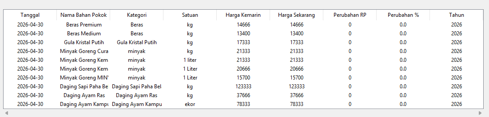
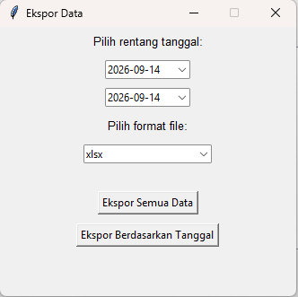
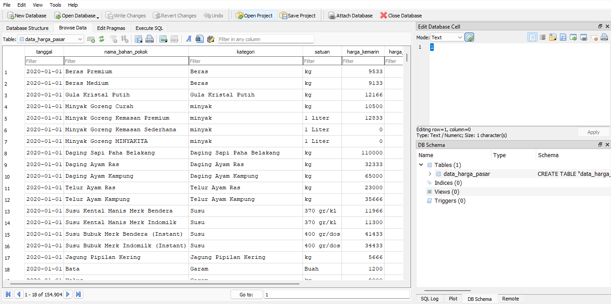

# 📊 SISKAPERBAPO — Web Scraping & Interactive Dashboard for Traditional Market Price Analysis

Web scraping, data processing, and interactive dashboard development for traditional market price analysis using SISKAPERBAPO data at BPS Kabupaten Tuban.

---

## 📌 Project Overview

This project was developed during an internship at Badan Pusat Statistik (BPS) Kabupaten Tuban to support the collection, processing, analysis, and visualization of traditional market price data from SISKAPERBAPO (Sistem Informasi Ketersediaan dan Perkembangan Harga Bahan Pokok di Jawa Timur).

---

## The project consists of two main components:

* Web Scraping Application
An application developed to automate the collection of market price data from SISKAPERBAPO.
* Interactive Dashboard
A dashboard developed to visualize and analyze market price data through interactive charts, tables, filters, and other analytical features.

The overall workflow integrates automated data collection with data processing, database storage, and interactive visualization to make market price information easier to monitor and analyze.

---

## 🏢 Background

BPS Kabupaten Tuban manages market price data from SISKAPERBAPO as an important source of information for monitoring the development of essential commodity prices and supporting public policy.

However, the volume and complexity of market price data can make the process of collecting, processing, and analyzing information time-consuming, particularly when monitoring price fluctuations across different commodities and periods.

To address these challenges, a **web scraping application and interactive dashboard** were developed.

The web scraping application automates the collection of market price data from SISKAPERBAPO, while the Power BI dashboard transforms the processed data into interactive visualizations that make price information easier to explore and analyze.

This solution is intended to improve the efficiency of data collection, simplify market price monitoring, and support data-driven analysis at BPS Kabupaten Tuban.

---

## 🎯 Project Objectives

### 1. Automate Market Price Data Collection

Implement web scraping techniques to automatically retrieve market price data from SISKAPERBAPO, reducing repetitive manual data collection and improving the efficiency of the data acquisition process.

### 2. Develop an Interactive Dashboard for Data Analysis

Develop an interactive dashboard that presents market price information through charts, tables, filters, and other visualizations to facilitate trend analysis and commodity comparisons.

### 3. Support Data-Driven Decision Making

Provide structured and up-to-date market price information that can support the monitoring and analysis of traditional market conditions at BPS Kabupaten Tuban.

---
## 📊 Data Source

The primary data source used in this project is:

**SISKAPERBAPO — Sistem Informasi Ketersediaan dan Perkembangan Harga Bahan Pokok di Jawa Timur** (https://siskaperbapo.jatimprov.go.id/)

The data contains information related to the prices of essential commodities observed in traditional markets.

The collected information includes several attributes related to market price observations, such as:

- Observation date
- Commodity name
- Commodity category
- Unit of measurement
- Previous price
- Current price
- Price change

The exact fields depend on the data retrieved from the SISKAPERBAPO source.

---

# 🔄 Project Workflow

The project follows an end-to-end data workflow:

### Workflow Stages

| Stage | Process | Main Output |
|---|---|---|
| **1. Data Collection** | Python + Selenium + Tkinter web scraping | Raw market price data |
| **2. Data Cleaning & Processing** | Data cleaning, transformation, and validation | Processed dataset |
| **3. Database Storage** | Store processed data in a structured database | Structured database |
| **4. Database Integration** | Integrate database with the visualization layer | Integrated data source |
| **5. Dashboard Development** | Power BI visualization and interactive filters | Interactive dashboard |
| **6. Evaluation & Improvement** | Functional, data, and visualization evaluation | Improved application & dashboard |

---

# 🕷️ 1. Web Scraping Application

The first component of this project is a desktop-based **Web Scraping Application** developed using **Python, Selenium, and Tkinter** to automate the collection of market price data from **SISKAPERBAPO**.

The application was designed to simplify the data collection process and reduce repetitive manual data retrieval. It provides an interface that allows users to select the required date range, retrieve market price data, preview the scraping results, and export the collected dataset.

The application provides the following functionalities:

- 📅 Select the data collection period
- 🔍 Extract market price information
- 🕷️ Start the web scraping process
- 📊 Preview collected data
- 📤 Export the collected dataset

The application reduces the need for repetitive manual data retrieval and provides a more structured approach to collecting market price information.

---

## 🖥️ Main Web Scraper Interface

The main interface was developed using **Tkinter** to provide a graphical user interface for collecting market price data from SISKAPERBAPO.

The interface consists of several components that support the data collection workflow, including date selection, data extraction, web scraping, and data preview.

### 📅 Date Range Selection

The application provides two date selectors:

- **Tanggal Awal** — Start date of the data collection period
- **Tanggal Akhir** — End date of the data collection period

Users can specify the required observation period before starting the scraping process. This allows the application to retrieve data for a specific period rather than processing the entire available dataset.

## 📥 Ekstrak Data

- Ekstrak Data button is used to initiate the data extraction process based on the selected date parameters.
- The extracted information is prepared for further processing within the application.

## ▶️ Mulai Scraping

- Mulai Scraping button starts the web scraping process.
- The application retrieves the required market price information from the SISKAPERBAPO source and displays the collected records in the data table.

## 📊 Scraping Result

After the scraping process is completed, the application displays the collected market price data in a structured tabular format.

The scraping result contains several attributes that describe the market price observations:

| Column | Description |
|---|---|
| **Tanggal** | Date of the market price observation |
| **Nama Bahan Pokok** | Name of the essential commodity |
| **Kategori** | Commodity category |
| **Satuan** | Unit of measurement |
| **Harga Kemarin** | Previous market price |
| **Harga Sekarang** | Current market price |
| **Perubahan** | Price change between the previous and current price |

The table allows users to review and verify the collected records directly within the application before exporting the dataset for further data cleaning, processing, database storage, and analysis.

---

## 📤 Data Export

After data collection, the application provides an Ekspor Data interface for exporting the collected dataset.

The export interface allows users to select:

- Start date
- End date
- File format

The current implementation provides .xlsx as an export format.

## 📦 Ekspor Semua Data

- Ekspor Semua Data button allows users to export the complete dataset available in the application.
- This feature is useful when the entire collected dataset is required for subsequent data processing, analysis, or archival purposes.

## 📅 Ekspor Berdasarkan Tanggal

- Ekspor Berdasarkan Tanggal button allows users to export data according to the selected date range.
- This feature provides more granular control over the exported dataset and allows users to obtain only the records required for a specific period.

## 🧩 Web Scraping Application Features

The web scraping application provides several features to support automated market price data collection and export:

| Feature | Description |
|---|---|
| **Date Range Selection** | Select the start and end dates for data collection |
| **Data Extraction** | Extract market price information based on the selected date range |
| **Web Scraping** | Automate the collection of market price data from SISKAPERBAPO |
| **Data Preview** | Display the collected records in a structured tabular format |
| **Price Information** | Display previous price, current price, and price changes |
| **Export All Data** | Export the complete collected dataset |
| **Export by Date** | Export data based on a selected date range |
| **Excel Export** | Export the collected data in `.xlsx` format |

---

## 🧹 2. Data Cleaning & Processing

The data collected through the web scraping process needs to be prepared before being stored and used for analysis.

The data processing stage is performed to ensure that the collected information is structured and suitable for subsequent database integration and visualization.

The processing workflow includes:

- Data validation
- Data cleaning
- Data transformation
- Data type adjustment
- Data formatting
- Handling inconsistencies
- Preparing data for database storage

---

## 🗄️ 3. Database Storage & Integration

After the data has been cleaned and processed, the resulting dataset is stored in a structured database.

The database acts as a centralized data source for the dashboard.
